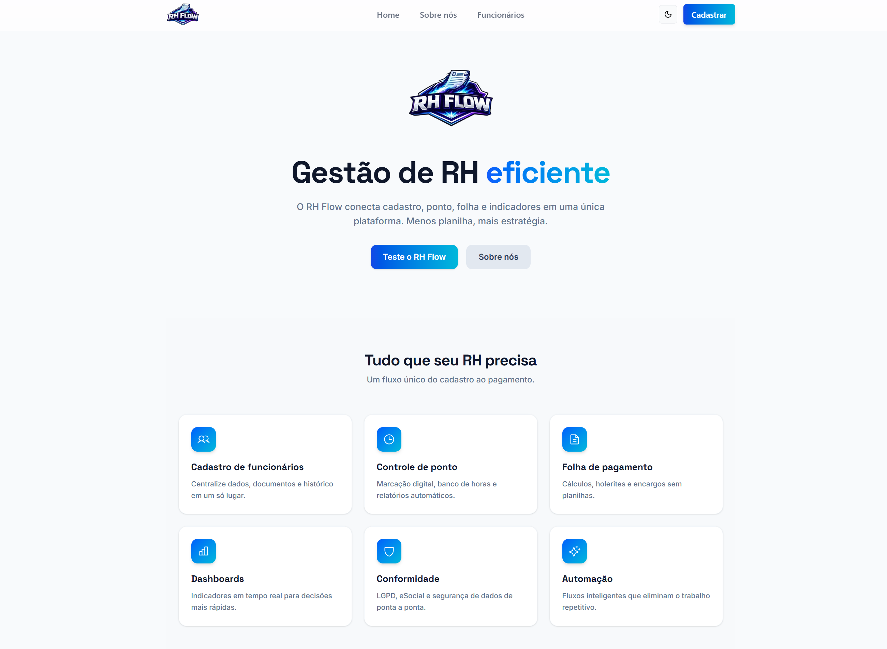

# 🚀 RH Flow

<p align="center">
  
</p>

## 📚 Sobre o Projeto

O **RH Flow** é um sistema inteligente para gestão e automação de processos de Recursos Humanos.

A aplicação foi desenvolvida para otimizar o gerenciamento de colaboradores, permitindo cadastro, visualização, atualização e remoção de funcionários de forma simples, moderna e organizada.

O projeto possui uma arquitetura fullstack com frontend e backend integrados, oferecendo uma interface intuitiva e uma API robusta para gerenciamento de dados.

O sistema foi desenvolvido pelo grupo **TwoStack** durante o bootcamp da Generation Brasil com foco na prática de desenvolvimento fullstack, integração de APIs REST e boas práticas de desenvolvimento web.

---

# 🚀 Funcionalidades

## 🏠 Home Page

* Página inicial estilizada
* Navbar personalizada
* Footer com redes sociais
* Layout responsivo

## 👥 Funcionários

* Cadastro de funcionários
* Listagem de funcionários
* Edição de funcionários
* Exclusão de funcionários
* Busca por ID
* Filtro por departamento
* Integração completa com API REST

---

# 🎨 Interface

O projeto utiliza uma identidade visual inspirada em sistemas modernos de gestão empresarial, utilizando:

* Tons de azul
* Componentes minimalistas
* Cards arredondados
* Layout responsivo
* Interface administrativa moderna

---

# 🛠 Tecnologias Utilizadas

## Frontend

* React
* TypeScript
* Vite
* Tailwind CSS

## Backend

* Node.js
* NestJS
* TypeScript

## Banco de Dados

* MySQL

---

# 📁 Estrutura do Projeto

```bash
RHFlow/
├── frontend/
├── backend/
├── assets/
└── README.md
```

---

# ⚙️ Como Executar o Projeto

## Clone o repositório

```bash
git clone https://github.com/seu-usuario/RHFlow.git
```

---

## Backend

```bash
cd backend
npm install
npm run start:dev
```

Servidor backend:

```bash
http://localhost:3000
```

---

## Frontend

```bash
cd frontend
npm install
npm run dev
```

Aplicação frontend:

```bash
http://localhost:5173
```

---

# 🔮 Implementações Futuras

* Novos filtros de pesquisa
* Dashboard administrativo
* Ordenação de funcionários
* Automação com triggers no banco de dados
* Sistema de autenticação

---

# 👥 Projeto em Equipe

Projeto desenvolvido em equipe durante o bootcamp da Generation Brasil.

## Integrantes

* [Beatriz Braga Silva](https://github.com/BiiaBraga)
* [Daniel Macedo](https://github.com/macedoo15)
* [Juliana Borges](https://github.com/jbgx014)
* [Lorena Godoi](https://github.com/lou-godoi)
* [Luanna Alcantara](https://github.com/luannaalcantara)
* [Lucas Araújo](https://github.com/lucaaas-araujo)

---

# 💜 Desenvolvido por

TwoStack